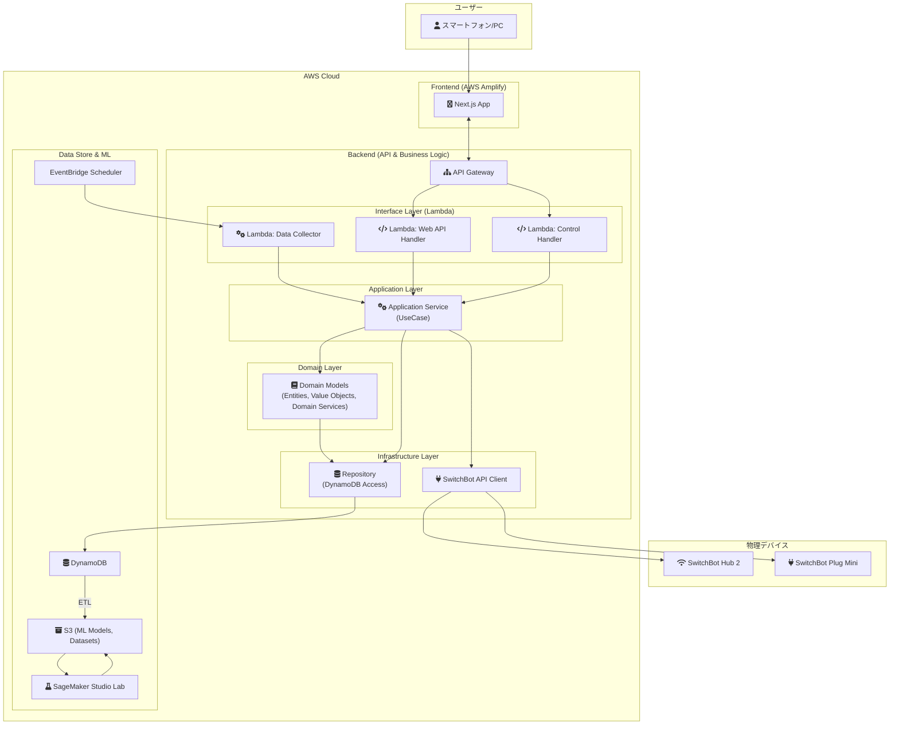

# システムアーキテクチャ

`SleepSmartAC` は、AWSのサーバーレスサービスを中心に構築されたスケーラブルで堅牢なシステムです。ドメイン駆動設計（DDD）の思想を取り入れたレイヤードアーキテクチャを採用し、保守性と拡張性を高めています。

---

## 1. 全体システムアーキテクチャ (DDD適用版)

---

## 2. レイヤーの説明

### Frontend
*   **Next.js (on AWS Amplify):** ユーザーが操作するWebアプリケーションです。バックエンドのAPI Gatewayと通信し、データの表示やユーザー入力を担当します。

### Backend (DDDレイヤードアーキテクチャ)
*   **Interface Layer (Lambda Handlers):**
    *   API GatewayやEventBridgeからのリクエストを直接受け取る薄い層です。
    *   リクエストのバリデーションや、後続のApplication Serviceへのデータの受け渡しのみを担当します。
*   **Application Layer (Use Cases):**
    *   「睡眠データを記録する」「最適なエアコン設定を提示する」といった、アプリケーションのユースケースを実装します。
    *   ドメインモデルやインフラストラクチャ層を組み合わせて処理フローを構築します。
*   **Domain Layer:**
    *   プロジェクトの核心部分です。「睡眠」「環境」「エアコン設定」といったドメイン（ビジネス領域）のルールやロジックをここに集約します。
    *   この層は、特定のフレームワークやDBに依存しない、純粋なビジネスロジックの塊となり、TDDを適用するのに最適な層です。
*   **Infrastructure Layer:**
    *   データベース（DynamoDB）へのアクセスや、外部API（SwitchBot API）の呼び出しなど、インフラストラクチャに関わる具体的な実装を担当します。

### Data Store & ML
*   **Amazon DynamoDB:** 収集した環境データ、電力消費量、ユーザーが入力した睡眠データを格納するNoSQLデータベースです。
*   **Amazon S3:** 機械学習の学習データセットや学習済みモデルを保存するストレージです。
*   **Amazon SageMaker Studio Lab:** 収集したデータを分析し、機械学習モデルを開発・学習させるための開発環境です。
*   **Amazon EventBridge (Scheduler):** データ収集用Lambdaを定期的に実行するためのスケジューラです。

---

## 3. 設計上の考慮事項

### セキュリティ
*   **認証・認可:** API Gatewayへのアクセスは `AWS Cognito` を利用したユーザー認証を導入し、不正なアクセスを防ぎます。各Lambda関数には、必要最小限の権限を持つIAMロールを割り当てます。
*   **データ暗号化:** DynamoDBやS3に保存されるデータは、`AWS KMS` を利用してサーバーサイドで暗号化します。
*   **秘密情報の管理:** SwitchBot APIのトークンなどの秘密情報は、`AWS Secrets Manager` または `Parameter Store` で安全に管理し、コードにハードコードしません。

### コスト管理
*   **サーバーレスの活用:** リクエストに応じてコンピューティングリソースが起動するサーバーレスアーキテクチャを全面的に採用し、アイドリングコストを最小化します。
*   **無料利用枠の活用:** AWSの無料利用枠を最大限に活用します。
*   **予算アラート:** `AWS Budgets` を設定し、想定外のコストが発生した場合に速やかに通知されるようにします。